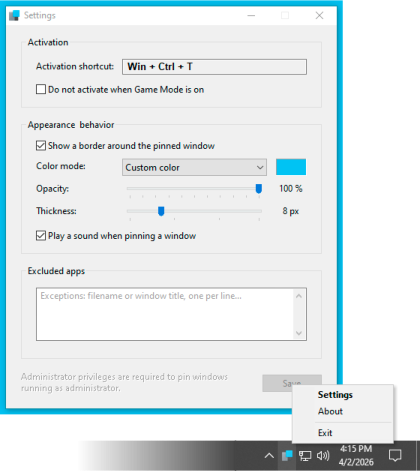

 

**PowerToys** is a set of 25 Microsoft utilities that, unfortunately, only install as a whole, without the option to select them.  
**AlwaysOnTop** is a utility in this set that allows you to pin a selected window on top of all other windows and highlight the pinned window with a colored, customizable frame.  
**Lite** is an alternative GUI for Microsoft PowerToys AlwaysOnTop — it allows you to launch, unload, and configure this application instead of the original PowerToys shell.

*This utility includes the PowerToys.AlwaysOnTop module, version 0.97.2.0, released under the MIT license. Information regarding Microsoft Corporation’s copyright for this module is provided in the program’s About section with a link to the original license.*

Created with AutoIt. MUI (EN|RU). No installation required.  
Copyright © NyBumBum 2026. All rights reserved.  
MIT License

